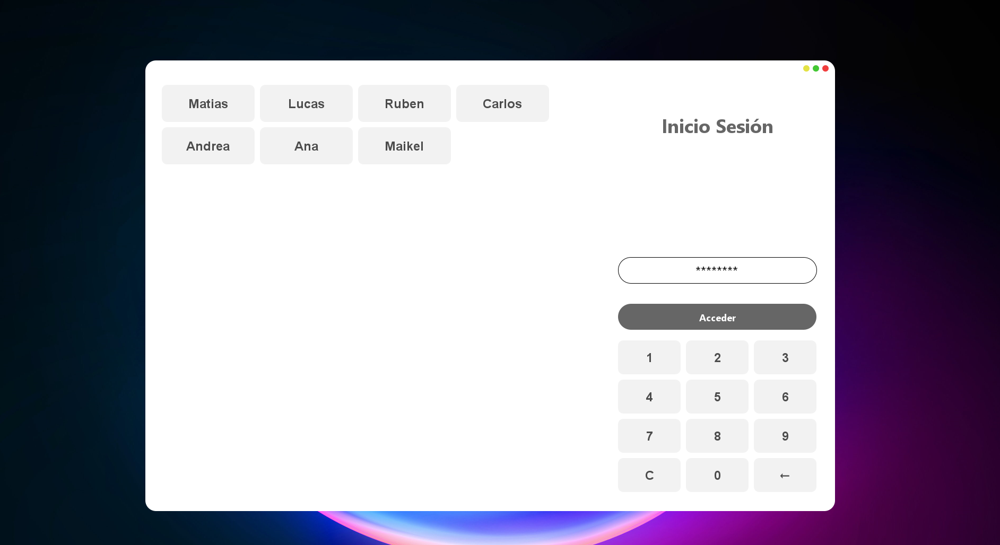
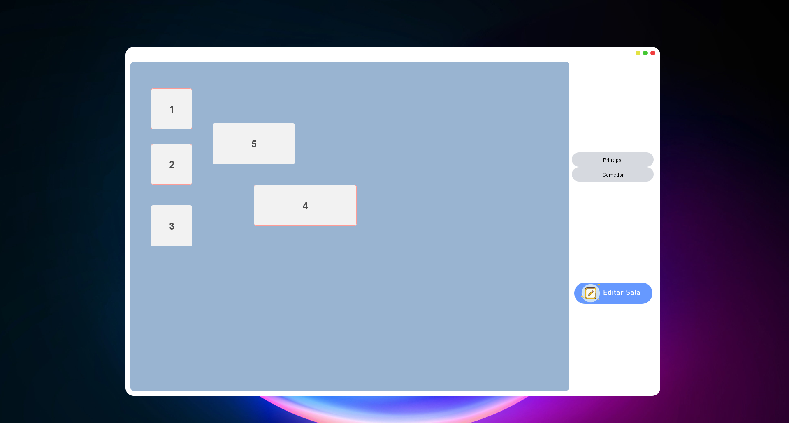
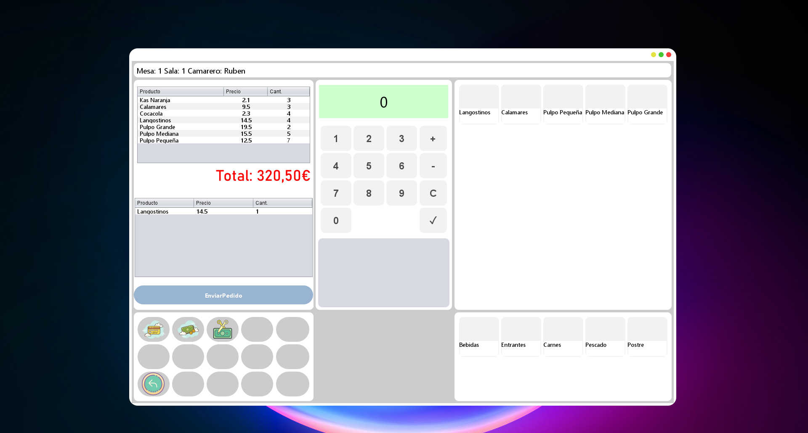

# Restaurant Management System

## Description

This is a personal project for restaurant management, developed to provide a comprehensive solution that allows users to log in and access according to their roles. The system facilitates table and POS (Point of Sale) management and allows orders to be sent to the kitchen, a functionality that is currently under development. It uses a relational database to manage all the information.

## Features

- Login system with specific roles (admin, waiter, chef)
- Table and reservation management
- POS management for taking orders and billing
- Sending orders to the kitchen (in development)
- Relational database for managing users, orders, tables, and products

## Screenshots

<p align="center">
  
</p>
<p align="center">
  
</p>
<p align="center">
  
</p>

## Getting Started

### Prerequisites

- Java Development Kit (JDK) 8 or later
- Git (for cloning the repository)
- A relational database management system (e.g., MySQL, PostgreSQL)

### Installation

1. Clone the repository:

```bash
git clone https://github.com/YourUsername/restaurant-management-system.git
cd restaurant-management-system
```

2.Set up the database:

- Create a database in your preferred DBMS.
- Run the schema.sql script located in the database folder to create the necessary tables.

Configure the database connection in your project with your database details. For example, if you're using JDBC, you might have a configuration like this:
```bash
jdbc.url=jdbc:mysql://localhost:3306/your_database
jdbc.username=your_username
jdbc.password=your_password
```
Build and run the project using your preferred build tool (e.g., Maven, Gradle) and execution method. Here is an example using Maven:
```bash
mvn clean install
mvn exec:java
```

### Usage

Log in with your assigned role (admin, waiter, chef) and start managing the restaurant.

## Roles and Functionalities
### Admin
- User and role management
- Table and menu configuration
### Waiter
- Taking orders
- Table management and billing
### Chef
- Viewing pending orders
- Updating order status

## Atributtions

### Icons and Images
- Icons: Iconos8 (https://www.iconos8.com)

## Libraries
Spring Boot: spring.io
Hibernate: hibernate.org
Thymeleaf: thymeleaf.org
